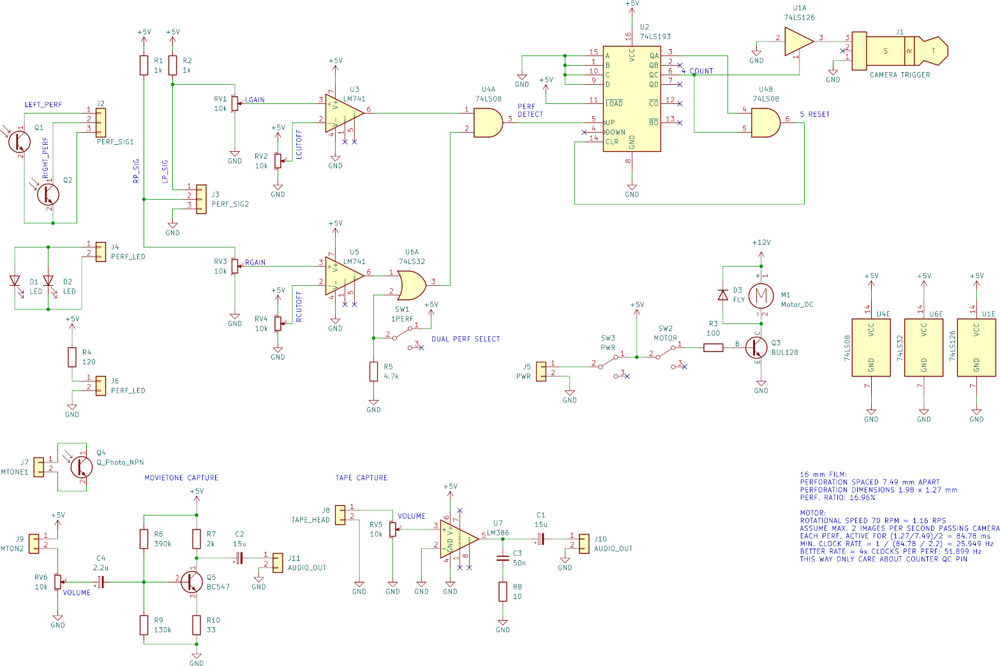

# 16mm Digitaliser
A slight improvement on the [8mm Digitaliser](https://github.com/azrieltomas/8mm-Digitaliser)
This is currently a work in progress and not fully implemented.


### Design
The hardware design to capture the frames utilises a constantly running motor, and dual IR sensors to determine when sprocket perforations have passed.
As 5+ frames can fit on the digital capture, photographs are taken every 5 frames. Cropping will be acheived by automatically offsetting the crop zone and exporting to separate images.

### Parts
Parts for aligning the film and holding the sensors are from various 3D prints.

```
TO DO: Add model diagram
```

### Controller
Each perforation sensor has two fine tuning methods:
* Gain (affects sensor output level)
* Cutoff (affects reference level).
The gain and cutoff signals are compared with an LM741 to determine if a perforation is sensed.This is adjustable to compensate for light sections along the film edge that are not perforations, but are still picked up by the sensor.Both perforation sensors are connected by an AND gate to a counter to further filter out non-perforations on single sides of the film.

For single perforation film, a switch sets the sense2 output to always on.\

Once the counter has reaches four, it triggers the camera, and resets on five via an AND gate on QA and QC.\

The motor can be switched on/off via a buffer circuit. I have used a BUL128 only because I have spares, and they're the only transistor on hand that can handle the motor current. It is probably wise to put a flyback diode on the motor.\

\
*Controller Design (KiCAD)*

### Audio
Audio is captured in two ways, depending on the storage method.
Digital processing can be done by any additional system.

#### Standard magnetic audio
Audio is picked up by a modified cassette tape head and amplified by an LM386 for simplicity.

#### Movietone
Audio is converted by an IR phototransistor - theoretically the same one used for the second set of perforations in dual perf film.
A BC547 amplifier boosts this to line levels.